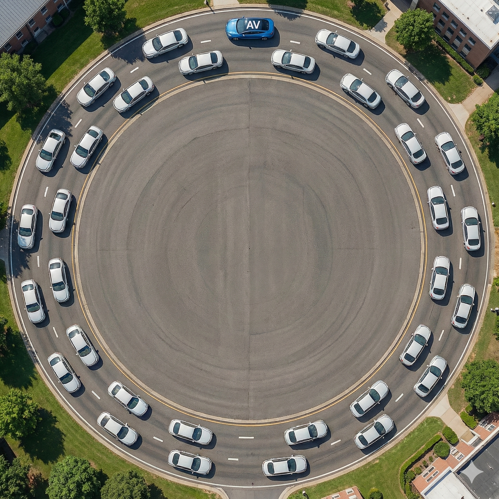
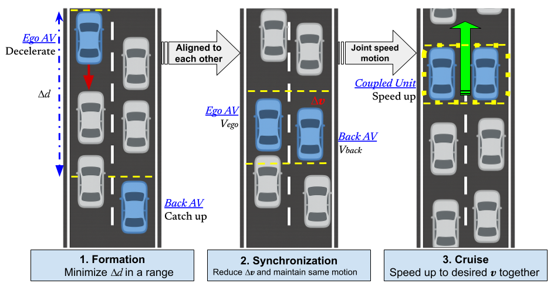
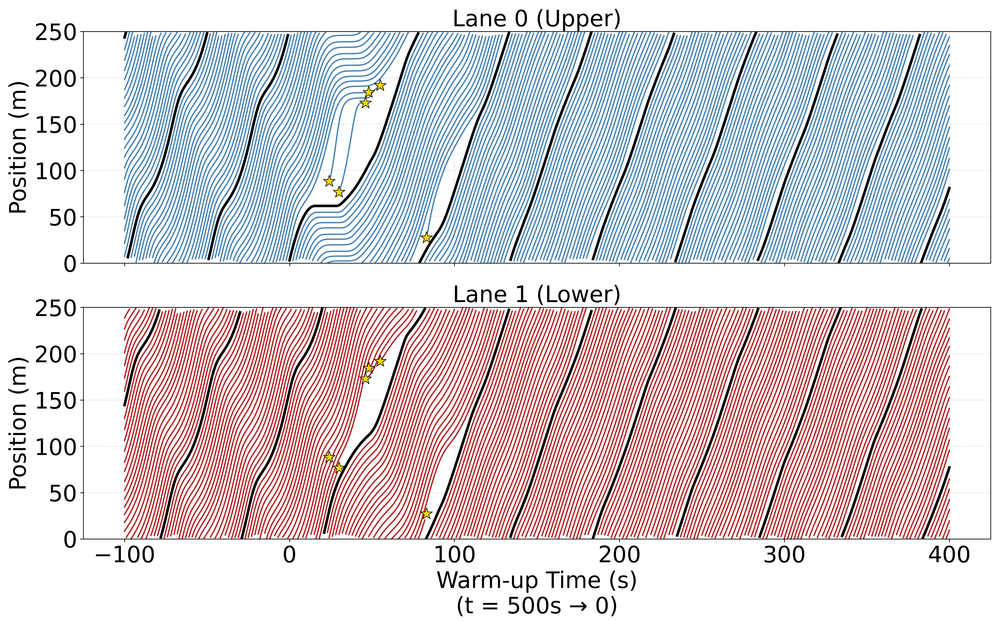
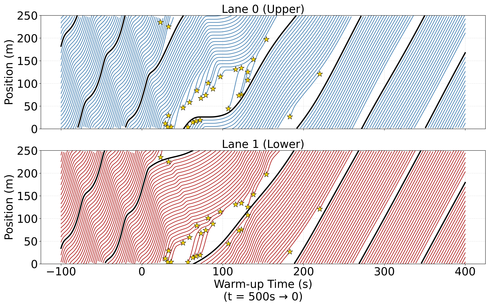
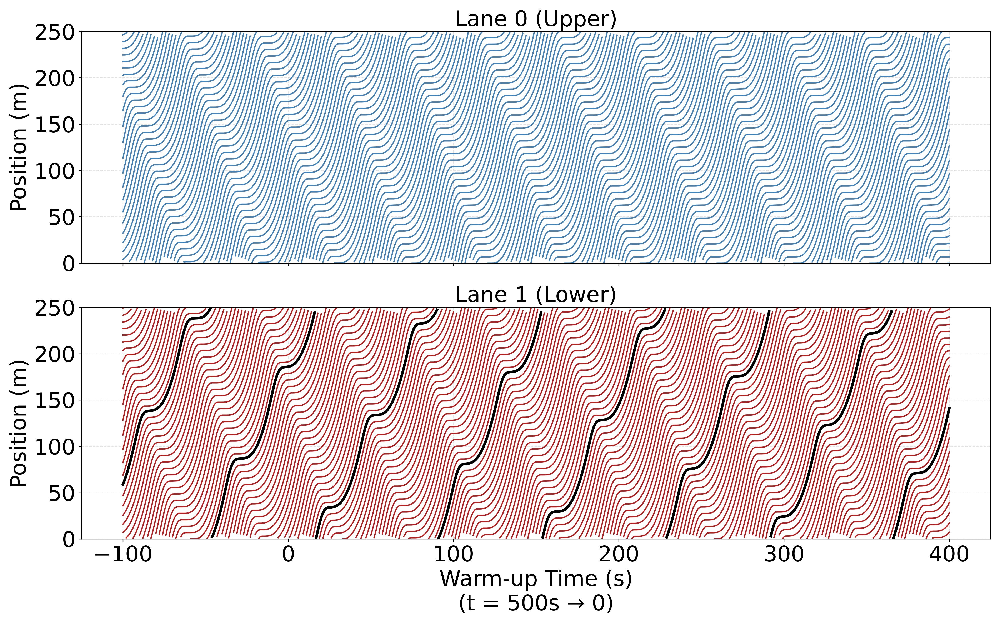
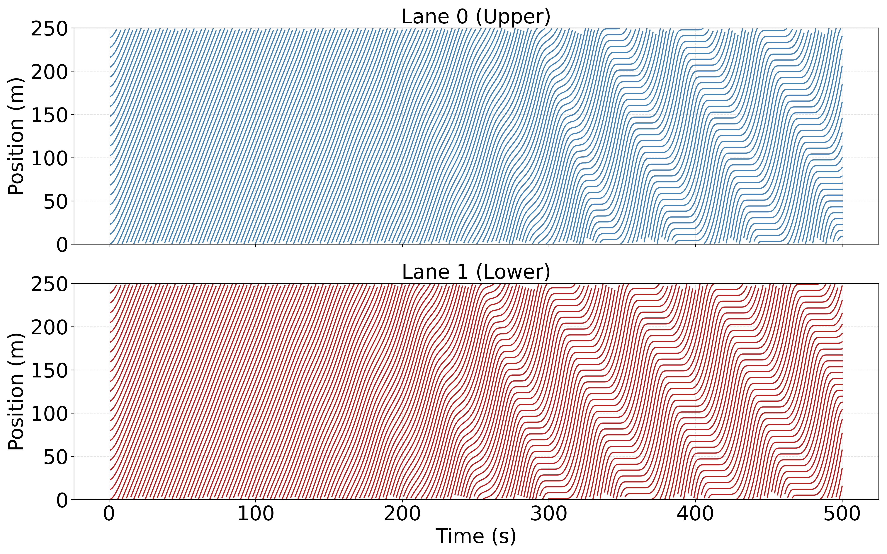
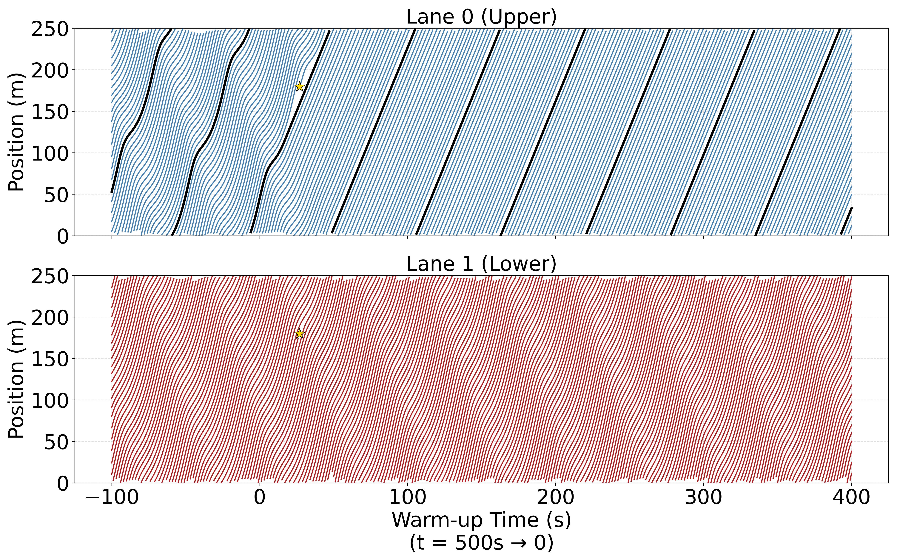
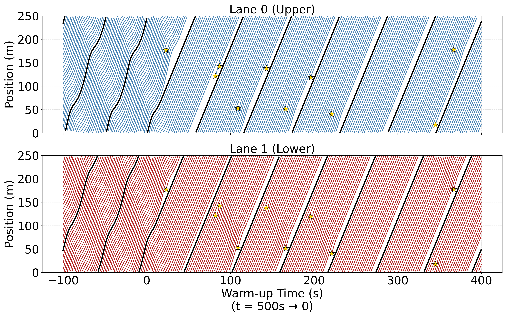
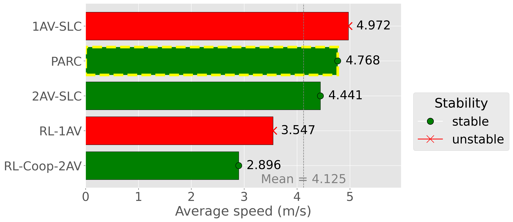

# RL-Inspired Controller of Mixed Traffic with Lane-Changing

[](LICENSE.md)
**📄 Read our paper:** [Control of Mixed-Autonomy Traffic via Autonomous Vehicles with Lane-Changing Behavior](Docs/ifac6pages.pdf)

## Overview

This repository contains the code, simulation environments, and experimental configurations for the paper **"Control of Mixed-Autonomy Traffic via Autonomous Vehicles with Lane-Changing Behavior."** 

We extend the [Flow](https://flow-project.github.io/) computational framework to address the destabilizing effects of human lane-changing in multi-lane mixed-autonomy traffic. Our core contribution is a novel rule-based, pair-aligned control strategy that synchronizes the motion of two Autonomous Vehicles (AVs) across lanes. By coupling two lanes into a single virtual lane, this controller effectively:
* Suppresses human lane-changing.
* Mitigates stop-and-go oscillations.
* Increases the stabilized average speed by **7.4%** compared to independent single-lane controllers.

<p align="center">
  
  <br>
  <em>Paired-controller design: The proposed rule-based controller coordinates the AVs, suppresses disruptive lane changes, and achieves stability and high efficiency.</em>
</p>

---

## Visualizations and Results

The following time-space diagrams and simulation recordings demonstrate the performance of different controllers evaluated on a double-lane ring road (see ).

### 1. The Proposed Approach
**Pair-Aligned Rule-Based Controller (PARC)**
Couples both lanes into a virtual lane to maximize throughput and stability.
* **Flowchart**: 
* **Trajectory**: 
<video src="Docs/PARC.mp4" width="800" controls></video>

### 2. Reinforcement Learning Controllers
**Cooperative RL Controller (2 AVs)**
Two AVs form a cross-lane paired structure, acting as a unified moving bottleneck to eliminate merging gaps.
* **Trajectory**: 
<video src="Docs/RL_Coop_2AV.mp4" width="800" controls></video>

**Single-Agent RL Controller (1 AV)**
The single AV minimizes headways to suppress lane changes, but oscillations persist.
* **Trajectory**: 
<video src="Docs/RL_1AV.mp4" width="800" controls></video>

### 3. Baselines & Comparisons
**Stop-and-Go Oscillations (All Human Drivers)**
Persistent oscillations driven by human lane-changing.
* **Trajectory**: 
<video src="Docs/stop_go_original.mp4" width="800" controls></video>

**Independent Single-Lane Controllers**
* **1 AV (Single-lane Controller)**:  | <video src="Docs/1AV_SLC.mp4" width="400" controls></video>
* **2 AVs (Independent Controllers)**:  | <video src="Docs/2AV_SLC.mp4" width="400" controls></video>

**Performance Metric**
* **Average Speed Comparison**: 

---

## Installation

This project requires **Python 3.7.3** and relies on **SUMO** for microscopic traffic simulation.

**1. Clone the repository**
```bash
git clone [https://github.com/TravidP/RL_Inspired_Controller_of_Mixed_Traffic_Lanechanging.git](https://github.com/TravidP/RL_Inspired_Controller_of_Mixed_Traffic_Lanechanging.git)
cd RL_Inspired_Controller_of_Mixed_Traffic_Lanechanging